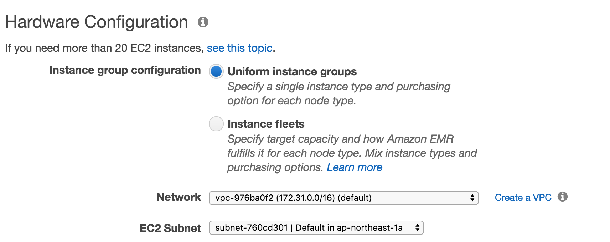
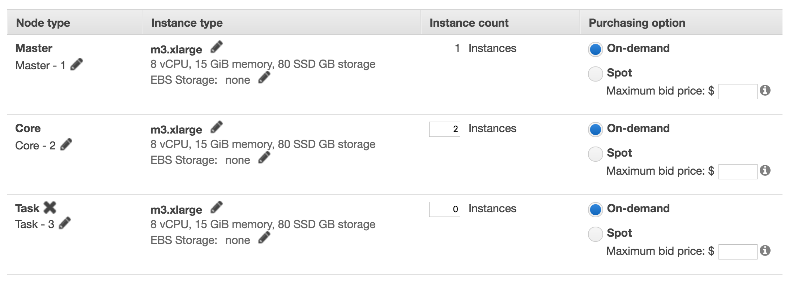
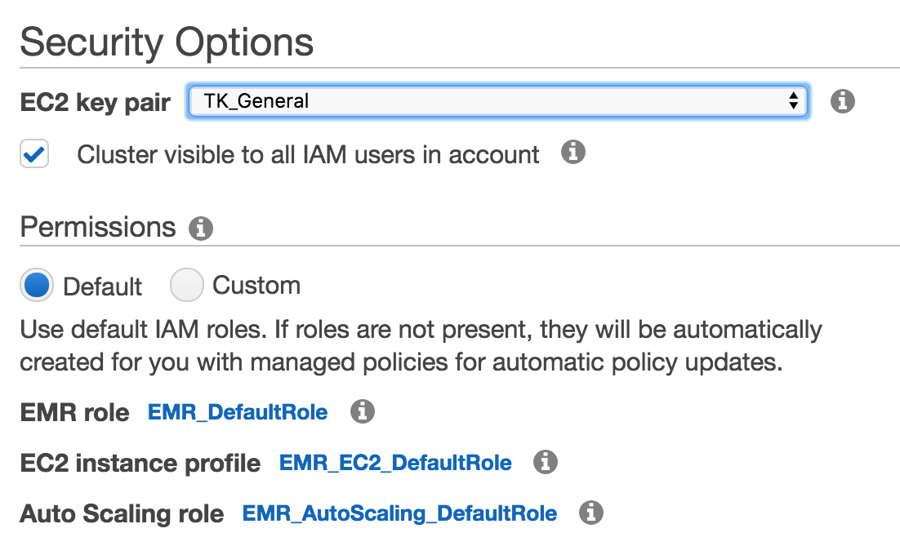
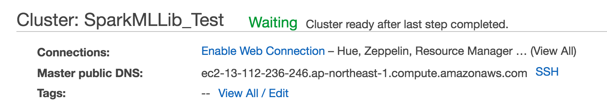
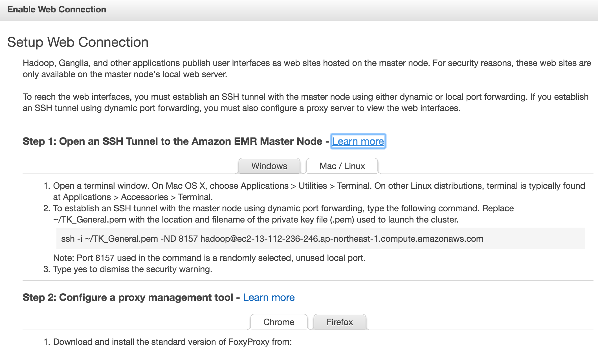
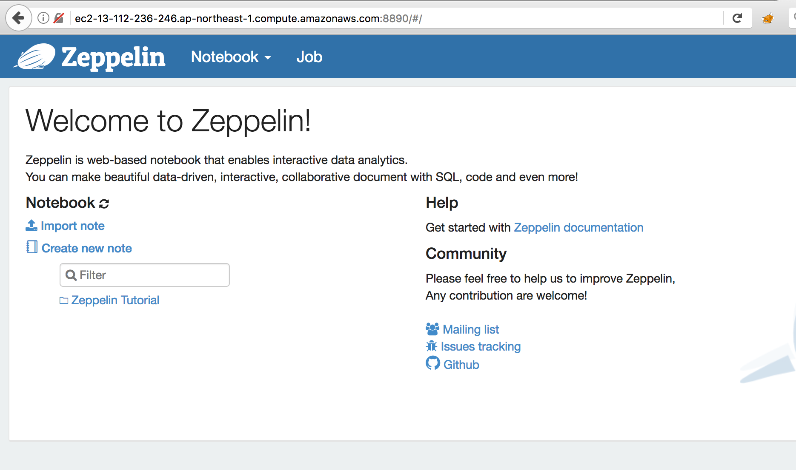
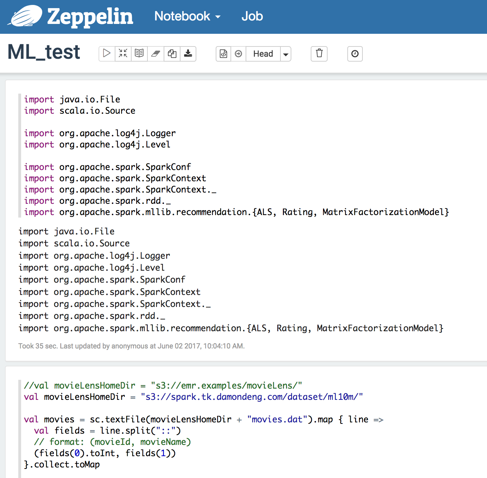

## Spark MLLib on EMR

This tutorial is based on Guy Ernest's blog "Building a Recommendation Engine with Spark ML on Amazon EMR using Zeppelin", with some modifications of the setting and update of the versions.

The following is the link of the blog:

<https://aws.amazon.com/cn/blogs/big-data/building-a-recommendation-engine-with-spark-ml-on-amazon-emr-using-zeppelin/>

### 1. Launch the cluster:

Login to AWS and open the console of EMR.

Click the "Create Cluster" button to create EMR cluster.

##### a. Software and steps

Click "Go to advanced options" link to switch to advanced options wizard.

In the "Release" field, select the latest "emr-x.x.x" version.

In the detail components page, make sure that "Hadoop 2.x.x" is checked. Then check the following two components: "Spark 2.x.x" and "Zeppelin x.x".

Then click "Next"

##### b. Hardware 

In hardware configuration section, the default VPC and one public subnet will be selected.

If you want to select your own VPC and subnet, make sure that the selected subnet is a public subnet.

In the instance section, select the right instance type and input the instance number you want.

For the purpose of demo, we select m3.xlarge as the Master node, and 2 m3.xlarge as the Core node.

Then click "Next"

##### c. General Cluster setting

In the "Cluster Name" field, give your cluster a proper name.

Then click "Next", keep other settings as default.

##### d. Security

In the security section, select a EC2 key pair for your EMR cluster so that you can login to the master node after you launch it.

Make sure that you have the private key of the EC2 key pair you select.

If you do not have any EC2 key pair, go to the EC2 console and create one for yourself.

Expand the EC2 Security Groups section, you will find that the default security groups for EMR are selected, "ElasticMapReduce-master" for master node and "ElasticMapReduce-slave" for core nodes and task nodes.

Remember the name of these security groups, you may need to modify it in the future.

Then click "Create Cluster" button to create the EMR cluster.

### 2. Connect to the cluster with ssh:

In the Cluster List section of EMR console, find the cluster you just created, open the cluster in console and wait for the cluster to be in "waiting" status.

Beside the "Master public DNS" field, you can see a "SSH" link, open the link you will get instructions of the command to connect to the EMR cluster, it is something like this:

	ssh -i ~/<keypaire_name>.pem hadoop@ec2-13-112-236-246.ap-northeast-1.compute.amazonaws.com

Open a terminal window and connect to the EMR master node with above command.

If you can't connect to the master node and get timeout error, please check the security group of master node, which is "ElasticMapReduce-master" by default, and make sure that port 22 is opened.

After you ssh to the master node, you will see the welcome screen of EMR master node:

	EEEEEEEEEEEEEEEEEEEE MMMMMMMM           MMMMMMMM RRRRRRRRRRRRRRR
	E::::::::::::::::::E M:::::::M         M:::::::M R::::::::::::::R
	EE:::::EEEEEEEEE:::E M::::::::M       M::::::::M R:::::RRRRRR:::::R
	  E::::E       EEEEE M:::::::::M     M:::::::::M RR::::R      R::::R
	  E::::E             M::::::M:::M   M:::M::::::M   R:::R      R::::R
	  E:::::EEEEEEEEEE   M:::::M M:::M M:::M M:::::M   R:::RRRRRR:::::R
	  E::::::::::::::E   M:::::M  M:::M:::M  M:::::M   R:::::::::::RR
	  E:::::EEEEEEEEEE   M:::::M   M:::::M   M:::::M   R:::RRRRRR::::R
	  E::::E             M:::::M    M:::M    M:::::M   R:::R      R::::R
	  E::::E       EEEEE M:::::M     MMM     M:::::M   R:::R      R::::R
	EE:::::EEEEEEEE::::E M:::::M             M:::::M   R:::R      R::::R
	E::::::::::::::::::E M:::::M             M:::::M RR::::R      R::::R
	EEEEEEEEEEEEEEEEEEEE MMMMMMM             MMMMMMM RRRRRRR      RRRRRR
	
	[hadoop@ip-172-31-13-121 ~]$
	[hadoop@ip-172-31-13-121 ~]$

Then you can use the `spark-shell` command to open the spark shell.

In spark shell, you can run scala program in interactive mode.

Please refer to the following output for detail of the spark shell interface and simple samples of scala:

	[hadoop@ip-172-31-13-121 ~]$ spark-shell
	Setting default log level to "WARN".
	To adjust logging level use sc.setLogLevel(newLevel). For SparkR, use setLogLevel(newLevel).
	17/06/01 13:00:44 WARN Client: Neither spark.yarn.jars nor spark.yarn.archive is set, falling back to uploading libraries under SPARK_HOME.
	17/06/01 13:01:04 WARN ObjectStore: Version information not found in metastore. hive.metastore.schema.verification is not enabled so recording the schema version 1.2.0
	17/06/01 13:01:04 WARN ObjectStore: Failed to get database default, returning NoSuchObjectException
	17/06/01 13:01:05 WARN ObjectStore: Failed to get database global_temp, returning NoSuchObjectException
	Spark context Web UI available at http://172.31.13.121:4040
	Spark context available as 'sc' (master = yarn, app id = application_1496284745884_0001).
	Spark session available as 'spark'.
	Welcome to
	      ____              __
	     / __/__  ___ _____/ /__
	    _\ \/ _ \/ _ `/ __/  '_/
	   /___/ .__/\_,_/_/ /_/\_\   version 2.1.0
	      /_/
	
	Using Scala version 2.11.8 (OpenJDK 64-Bit Server VM, Java 1.8.0_121)
	Type in expressions to have them evaluated.
	Type :help for more information.
	
	scala> val a = 10
	a: Int = 10
	
	scala> val b = 20
	b: Int = 20
	
	scala> a + b
	res0: Int = 30
	
	scala>

You can write your Machine Learning code with scala, and you can import libraries of Spark ML Lib in the spark shell too. But the user interface is not so friendly, we have better way to do it.

Exit the spark shell with `ctr-c` and exit the ssh window.

### 2. Connect to the Zeppelin:

We selected the software component "Zeppelin" while creating the EMR cluster, so we can connect to the Zeppelin web user interface.

As port "8890" is used by Zeppelin, and we only open port 22 in the security group of master node, we can't connect to Zeppelin directly.

We need to create a ssh tunnel config our browser to use this tunnel.

There is a detail instruction of the steps to create the tunnel and config the browser. Click the "Enable Web Connection" link in the connections field:

Then you have the detail steps to setup the web connection:

There are two steps: the first step is launching the ssh tunnel, the second step is installing the proxy plug-in and config the proxy setting.

To launch the ssh tunnel, just open a terminal window and run the following command:

	ssh -i ~/TK_General.pem -ND 8157 hadoop@ec2-13-112-236-246.ap-northeast-1.compute.amazonaws.com

The number 8157 is the port we use locally for the tunnel.

To install the proxy plug-in, just download the software with the link provided in the instruction window and install it. The software download link is something like this:

<http://foxyproxy.mozdev.org/downloads.html>

Install the plug-in and then restart the browser to enable the plug-in.

Then create a proxy setting file and copy all the setting in the instruction windows into the setting file.

After that, import the proxy setting file for the proxy plug-in in the "Tools" menu of the browser.

The proxy setting file should contain something like the following XML document, but it is not a good idea to copy the following document, you need to copy the XML document from your instruction window, As there may be some differentiations between your VPC and mine.

	<?xml version="1.0" encoding="UTF-8"?>
	<foxyproxy>
	    <proxies>
	        <proxy name="emr-socks-proxy" id="2322596116" notes="" fromSubscription="false" enabled="true" mode="manual" selectedTabIndex="2" lastresort="false" animatedIcons="true" includeInCycle="true" color="#0055E5" proxyDNS="true" noInternalIPs="false" autoconfMode="pac" clearCacheBeforeUse="false" disableCache="false" clearCookiesBeforeUse="false" rejectCookies="false">
	            <matches>
	                <match enabled="true" name="*ec2*.amazonaws.com*" pattern="*ec2*.amazonaws.com*" isRegEx="false" isBlackList="false" isMultiLine="false" caseSensitive="false" fromSubscription="false" />
	                <match enabled="true" name="*ec2*.compute*" pattern="*ec2*.compute*" isRegEx="false" isBlackList="false" isMultiLine="false" caseSensitive="false" fromSubscription="false" />
	                <match enabled="true" name="10.*" pattern="http://10.*" isRegEx="false" isBlackList="false" isMultiLine="false" caseSensitive="false" fromSubscription="false" />
	                <match enabled="true" name="*10*.amazonaws.com*" pattern="*10*.amazonaws.com*" isRegEx="false" isBlackList="false" isMultiLine="false" caseSensitive="false" fromSubscription="false" />
	                <match enabled="true" name="*10*.compute*" pattern="*10*.compute*" isRegEx="false" isBlackList="false" isMultiLine="false" caseSensitive="false" fromSubscription="false" />
	                <match enabled="true" name="*.compute.internal*" pattern="*.compute.internal*" isRegEx="false" isBlackList="false" isMultiLine="false" caseSensitive="false" fromSubscription="false" />
	                <match enabled="true" name="*.ec2.internal*" pattern="*.ec2.internal*" isRegEx="false" isBlackList="false" isMultiLine="false" caseSensitive="false" fromSubscription="false" />
	            </matches>
	            <manualconf host="localhost" port="8157" socksversion="5" isSocks="true" username="" password="" domain="" />
	        </proxy>
	    </proxies>
	</foxyproxy>

After you finish the configuration job, remember to click "Tools -> Standard FoxyProxy" and choose "Use proxies based on their pre-defined patterns and priorities".

Then you will see an icon of fox beside the address field of your browser.

As I mentioned before, port "8890" is used by software Zeppelin, we can access the Zeppelin home page with the following URL link, remember to modify the DNS name to the DNS name of your EMR cluser: 

<http://ec2-13-112-236-246.ap-northeast-1.compute.amazonaws.com:8890>

And the following is the screen dump of the home page:

You can click the "Create new note" link to create your note book and start to run your Machine Learning code.

To run the recommendation demo, you can create a new note book and copy the sample code from the original blog:

<https://aws.amazon.com/cn/blogs/big-data/building-a-recommendation-engine-with-spark-ml-on-amazon-emr-using-zeppelin/>

To save your time, you can just download the sample I created and then import it to your Zeppelin with the "Import note" link on the home page of Zeppelin.

The download link of the sample note book is:
<https://github.com/DamonDeng/SparkMLLib_tutorial/blob/master/getting_start/ML_test.json>

It is a json file, download it to you laptop, and then click the "Import note" link on Zeppelin home page to import the json file you just downloaded.

After you import it, you will see something like this:

Click the "Run All Paragraphs" button, which is a triangle icon, to run whole sample.

The following is the explanation of the code:

The following code import all the necessary libaries:

	import java.io.File
	import scala.io.Source
	
	import org.apache.log4j.Logger
	import org.apache.log4j.Level
	
	import org.apache.spark.SparkConf
	import org.apache.spark.SparkContext
	import org.apache.spark.SparkContext._
	import org.apache.spark.rdd._
	import org.apache.spark.mllib.recommendation.{ALS, Rating, MatrixFactorizationModel}

The we start to load the sample data set:

	//val movieLensHomeDir = "s3://emr.examples/movieLens/"
	val movieLensHomeDir = "s3://spark.tk.damondeng.com/dataset/ml10m/"
	
	val movies = sc.textFile(movieLensHomeDir + "movies.dat").map { line =>
	  val fields = line.split("::")
	  // format: (movieId, movieName)
	  (fields(0).toInt, fields(1))
	}.collect.toMap
	
	val ratings = sc.textFile(movieLensHomeDir + "ratings.dat").map { line =>
	  val fields = line.split("::")
	  // format: (timestamp % 10, Rating(userId, movieId, rating))
	  (fields(3).toLong % 10, Rating(fields(0).toInt, fields(1).toInt, fields(2).toDouble))
	}

The original URL link of the sample is <s3://emr.examples/movieLens/>,
which you may not have right to access. You can use the mirror link:
<s3://spark.tk.damondeng.com/dataset/ml10m/>.

Then we print out the numbers of the training data, it is a good practice to  check the training data before you really train your model.
	
	val numRatings = ratings.count
	val numUsers = ratings.map(_._2.user).distinct.count
	val numMovies = ratings.map(_._2.product).distinct.count
	
	println("Got " + numRatings + " ratings from "
	  + numUsers + " users on " + numMovies + " movies.")

Then we split the data into training set, validation set and testing set based on the first field of ratings, which is an integer between 0 and 9.
	
	val training = ratings.filter(x => x._1 < 6)
	  .values
	  .cache()
	val validation = ratings.filter(x => x._1 >= 6 && x._1 < 8)
	  .values
	  .cache()
	val test = ratings.filter(x => x._1 >= 8).values.cache()
	
	val numTraining = training.count()
	val numValidation = validation.count()
	val numTest = test.count()
	
	println("Training: " + numTraining + ", validation: " + numValidation + ", test: " + numTest)

Then define Root Mean Squared Error method:

	/** Compute RMSE (Root Mean Squared Error). */
	def computeRmse(model: MatrixFactorizationModel, data: RDD[Rating], n: Long): Double = {
	    val predictions: RDD[Rating] = model.predict(data.map(x => (x.user, x.product)))
	    val predictionsAndRatings = predictions.map(x => ((x.user, x.product), x.rating))
	    .join(data.map(x => ((x.user, x.product), x.rating))).values
	    math.sqrt(predictionsAndRatings.map(x => (x._1 - x._2) * (x._1 - x._2)).reduce(_ + _) / n)
	}
	
Now, we can try to train it:

	val ranks = List(8, 12)
	val lambdas = List(0.1, 10.0)
	val numIters = List(10, 20)
	var bestModel: Option[MatrixFactorizationModel] = None
	var bestValidationRmse = Double.MaxValue
	var bestRank = 0
	var bestLambda = -1.0
	var bestNumIter = -1
	for (rank <- ranks; lambda <- lambdas; numIter <- numIters) {
	  val model = ALS.train(training, rank, numIter, lambda)
	  val validationRmse = computeRmse(model, validation, numValidation)
	  println("RMSE (validation) = " + validationRmse + " for the model trained with rank = " 
	    + rank + ", lambda = " + lambda + ", and numIter = " + numIter + ".")
	  if (validationRmse < bestValidationRmse) {
	    bestModel = Some(model)
	    bestValidationRmse = validationRmse
	    bestRank = rank
	    bestLambda = lambda
	    bestNumIter = numIter
	  }
	}

You will get output like the following, telling you the result of the training:

	ranks: List[Int] = List(8, 12)
	lambdas: List[Double] = List(0.1, 10.0)
	numIters: List[Int] = List(10, 20)
	bestModel: Option[org.apache.spark.mllib.recommendation.MatrixFactorizationModel] = None
	bestValidationRmse: Double = 1.7976931348623157E308
	bestRank: Int = 0
	bestLambda: Double = -1.0
	bestNumIter: Int = -1
	RMSE (validation) = 0.82452138173397 for the model trained with rank = 8, lambda = 0.1, and numIter = 10.
	RMSE (validation) = 0.818067307675006 for the model trained with rank = 8, lambda = 0.1, and numIter = 20.
	RMSE (validation) = 3.667982949261605 for the model trained with rank = 8, lambda = 10.0, and numIter = 10.
	RMSE (validation) = 3.667982949261605 for the model trained with rank = 8, lambda = 10.0, and numIter = 20.
	RMSE (validation) = 0.8209511941203284 for the model trained with rank = 12, lambda = 0.1, and numIter = 10.
	RMSE (validation) = 0.8158746540629233 for the model trained with rank = 12, lambda = 0.1, and numIter = 20.
	RMSE (validation) = 3.667982949261605 for the model trained with rank = 12, lambda = 10.0, and numIter = 10.
	RMSE (validation) = 3.667982949261605 for the model trained with rank = 12, lambda = 10.0, and numIter = 20.

After we train the model, we can try to predict movies recommendations with the model:

	val candidates = sc.parallelize(movies.keys.toSeq)
	val recommendations = bestModel.get
	  .predict(candidates.map((100, _)))
	  .collect()
	  .sortBy(- _.rating)
	  .take(10)
	
	var i = 1
	println("Movies recommended for you:")
	recommendations.foreach { r =>
	  println("%2d".format(i) + ": " + movies(r.product))
	  i += 1
	}

Then you can save your best model to S3:
	
	// Save and load model
	bestModel.get.save(sc, "s3://spark.tk.damondeng.com/movieLens/model/recommendation")
	val sameModel = MatrixFactorizationModel.load(sc,  "s3://spark.tk.damondeng.com/movieLens/model/recommendation")

